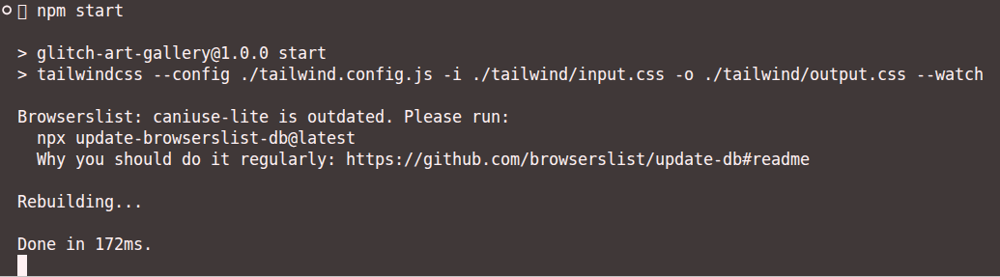

**Documented by:** `Sanskar Bhusal`  
**Version:** `1.1`
## After you clone the repository, run the following command.

`npm install`  
This command installs neccesary tailwind library. 

## Now that tailwind is installed, run following command.

`npm start`  
This command starts tailwind compiler in watch mode.

You will see something like this:

Congrats!, you can now use tailwind.

**`Note:`** The tailwind classes are applied as soon as you save changes (ctrl + s) in your editor. Just remember to fire the `npm start` command and leave it running before you start working on code.
